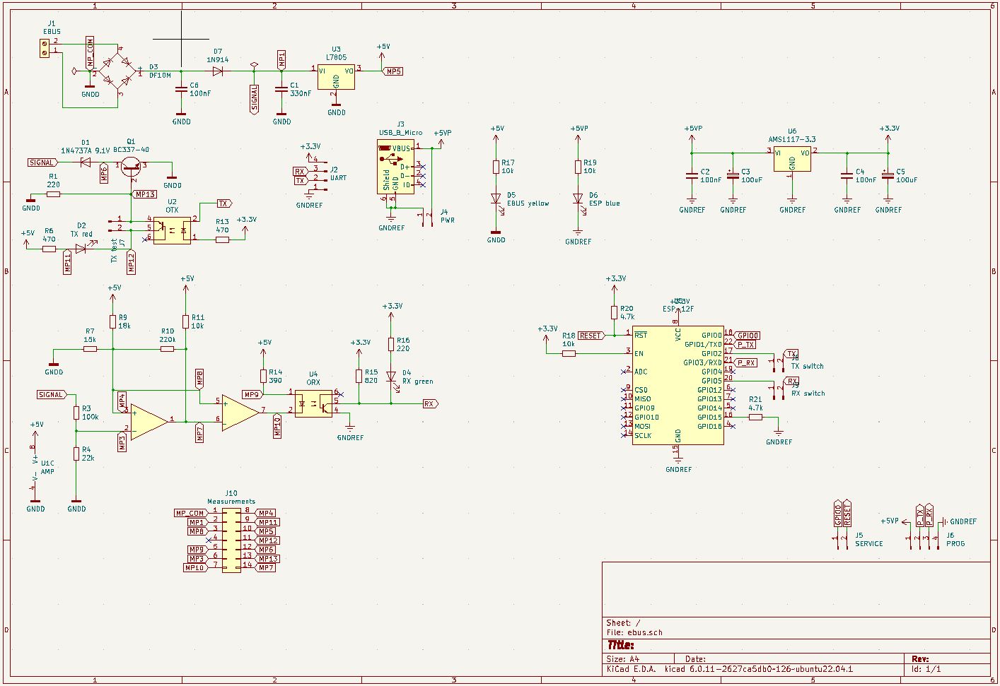

# eBUS Adapter for ESP8622

eBUS adapter PCB for use with [ebusd-esp](https://github.com/john30/ebusd-esp) firmware as well as with other UART devices.

Schematic inspired by [ebus adapter 2](https://github.com/eBUS/adapter), so it inherits GPL license.

## Schematic

## PCB design

